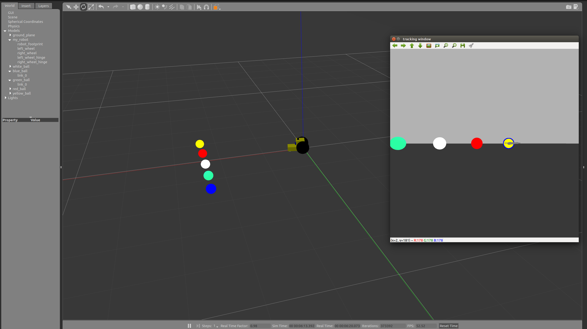
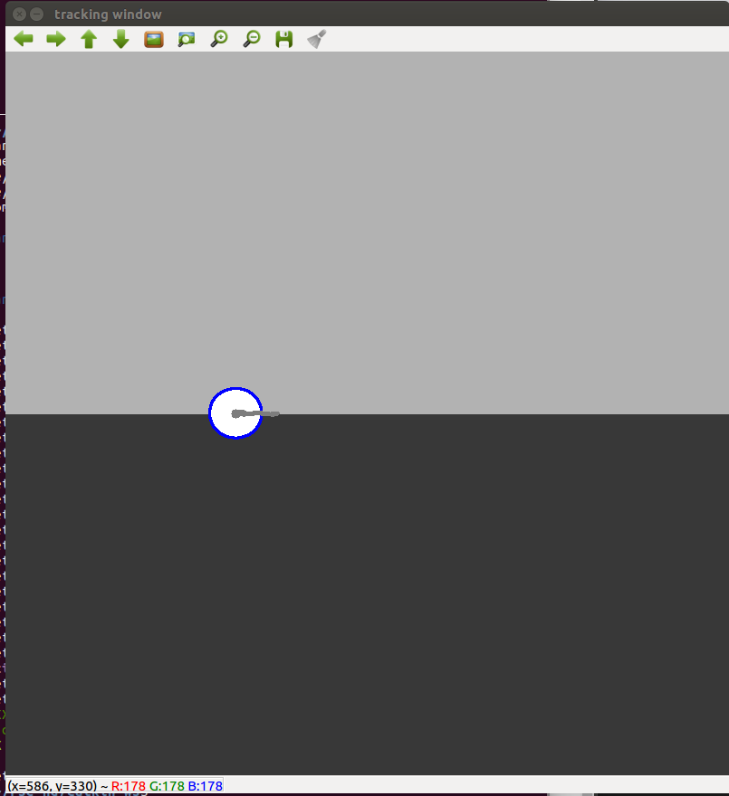
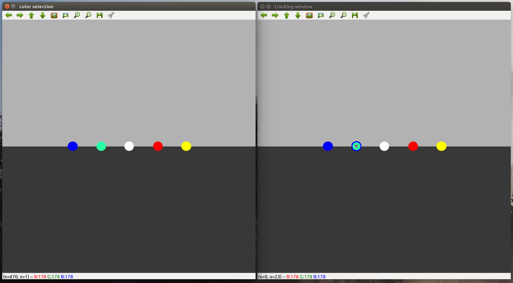
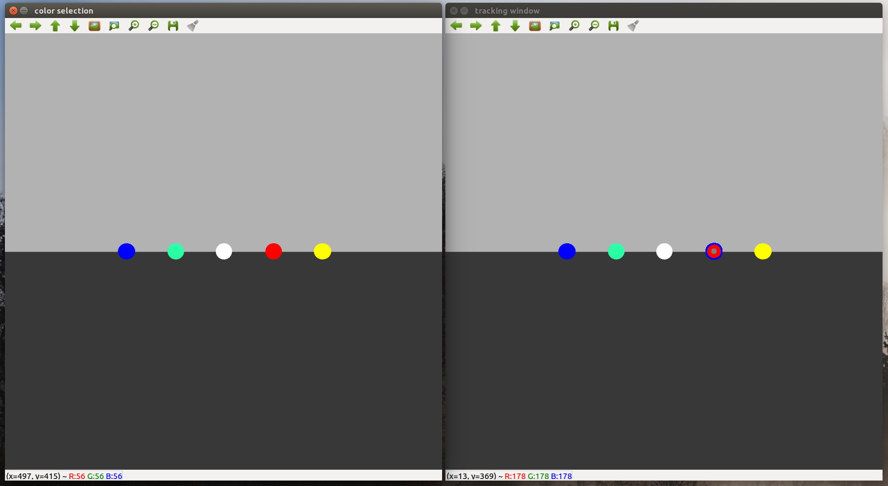

# Go Chase It!

## Description
This is the second project in the nanodegree program. The goal was to program a robot to chase a white ball. This is accomplished by reading camera data from the robot and analyzing it for the position of the ball, and subsequently sending commands to drive the robot towards the ball. 



#### Ball tracking
I decided to use OpenCV to process the image data from the camera. By using more advanced image processing I was able to do some fun stuff, like adding a ring around the ball and a trail of where the center of the ball had been. These features used some simple thresholding and then edge detection. The image processing is done in `process_image.cpp` and the robot control is in `drive_bot.cpp`.



#### Ball color selection
A more useful feature was enabling user selection of the desired ball color that the robot should chase. By simply clicking on a ball, the robot would go after it. This was enabled by reading the click data from the user and sending the color information to the image processing pipeline. The color selection is in `select_ball_color.cpp`.

Select the ball in the right window, and the left window shows the tracking information.




## Run 
*This assumes you have built the package in your catkin workspace.*

#### Launch the world with the robot and balls 
```bash
$ roslaunch my_robot world.launch
```
This will launch Gazebo and Rviz. The robot and different colored balls will be inside.

#### Launch the robot drive controller
In a seperate terminal:
```bash
$ roslaunch ball_chaser ball_chaser.launch
```
This will start the differential drive controller for the robot. It will automatically start chasing any white ball it sees. This can be seen in the OpenCV `tracking window` that will be created on launch.

#### Optional, start the ball selection
In a seperate terminal:
```bash
$ rosrun ball_chaser select_ball_color
```
This will open a new OpenCV window, `color selection`, where you can click on different color balls to be chased. 

## Notes
- This hasn't been tested with multiple balls of the same color, however the thresholding and countour finding is setup to only find one edge, thus only one ball. 
- The thresholding is based on the HSV color model.
- The color selection publishes a [ColorRGBA](http://docs.ros.org/melodic/api/std_msgs/html/msg/ColorRGBA.html) message type. The red value of this message is the hue, green is saturation, and blue is value. Alpha is always 1. 
