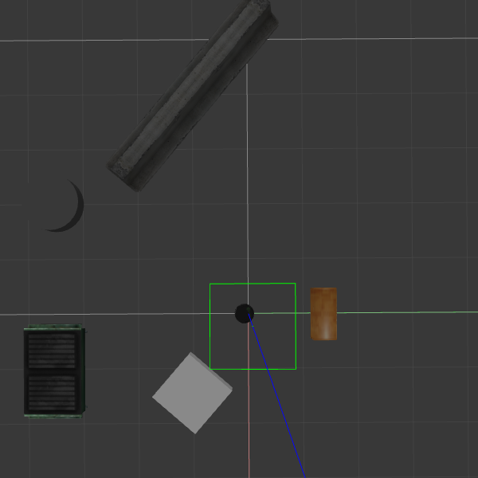

# Home service robot

## Description

This is the final project in the nanodegree program. The goal is to create and program a robot that can autonomously navigate in an environment to pick up virtual items and then deliver them to a different location. This is accomplished by using a combination of available ROS packages (to handle SLAM and path planning) with some self-made packages (to manage communication about positions and the virtual items).

The project demonstrates some fundamental and very important concepts in robotics, namely __localization__, __mapping__, and __path planning__. They are described in more detail below.

### Localization

Localization is the act of a robot determining where it is in its environment. This is a common requirement for any meaningful robot interaction with its environment because once localized, the robot can freely move about to specific points of interest. As the sections below illustrate there are some very useful additions to add on top of localization to make a robot's life much easier. 

### Mapping

Mapping creates a "memory" for the robot to understand where it has been before in its environment. This enables effective path planning and efficient movement from location to location. In this project the mapping is actually done using a SLAM (simultaneous localization and mapping) package - specifically the [gmapping package](http://wiki.ros.org/gmapping). This packages allows for autonomous mapping of the environment, which is quite handy.

However, in this project it was demonstrated by manually driving a robot around an environment with some objects in it. The pictures below (from left to right) show the robot in its environment, the map before creation, and a map after driving around the obstacles a little bit. If you'd like to check this out you can run the `test_slam.sh` shell script found in the scripts directory. 

| environment | no map | map |
| :---: | :---: | :---: |
|  |  |   | 

### Path Planning

The path planning and navigation is done using the [turtlebot_gazebo package](http://wiki.ros.org/turtlebot_gazebo). Under the hood, this is based on Dijkstra's shortest path algorithm, which is a variant of the Uniform Cost Search algorithm. Using a path planning package like this permits a robot to avoid any encountered obstacles in its path by re-planning a new trajectory.

### Virtual Objects

To illustrate the usefulness of the aforementioned algorithms and their packages, a virtual object was created in the environment. This object is the target for the robot to autonomously navigate to. Once the object is reached, the robot "picks" it up. Next, the robot navigates to a drop off location and "drops" off the object. There are two packages to manage this, `add_markers` and `pick_objects`. 

#### Add Markers

This node subscribes to the robot's physical location to determine whether the robot is close enough to pick something up or drop something off. It will display the object until the robot is in range, and then hide it, simulating a pick up. Once the robot has reached a drop off location, it will show a object at that location. 

#### Pick Objects 

This node simply sends pick up and drop off locations to the robot to navigate to.

